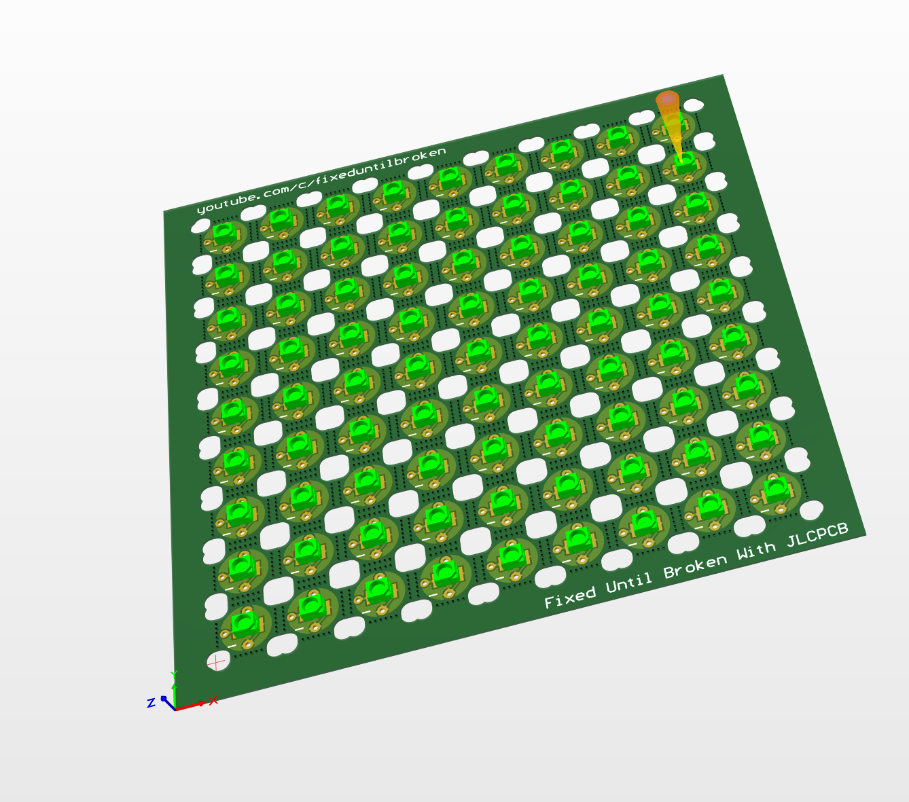

# LED-Panel
This Panel isn't perfect but it gets the job done! It was designed in Altium. 

# Instuctions For Ordering
Download the Zip file and then upload to your board house.
PCBs from $0 https://jlcpcb.com/IYB (Free Setup, Free Stencil and Coupons!) 

# Parts needed
3528 LED
0803 Resistor
22 AGW BUS wire.

# Assembly
Can be done in reflow oven, Hot plate or with hot air. If uing a hot plate you will only be able to do one side with it and then hand soldering the rest. I would do the leds with the hot plate if that is the route you go. I used hot air and solderpaste myself.

Main thing to note is to do all the solder work and then cut them out of the panal. the PCBs are really too small to work with if you don't.
